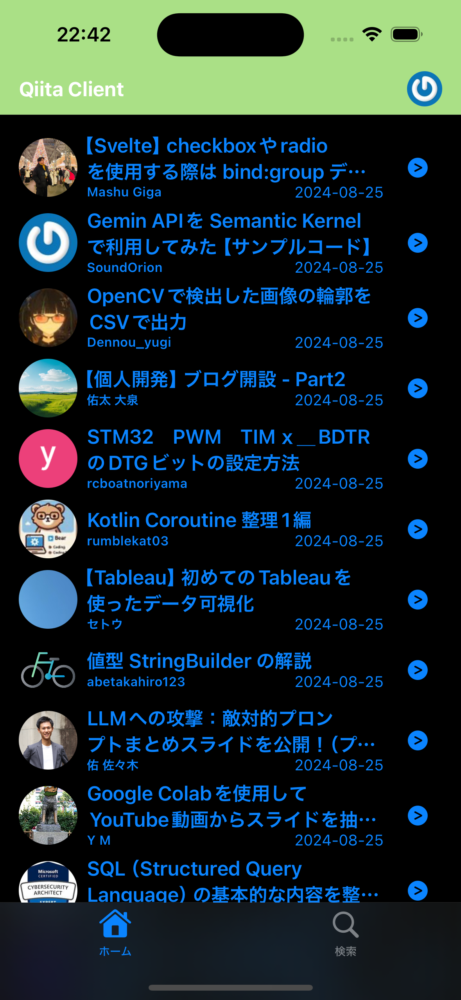
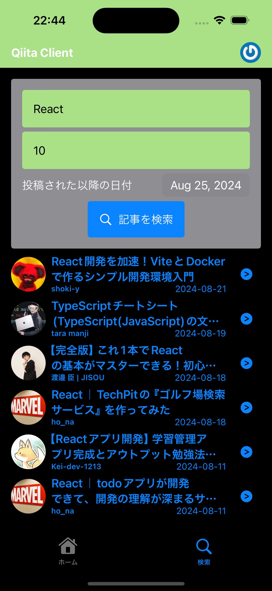

# QiitaSwiftClient

Unofficial Qiita Client App made in SwiftUI.

## Features

- 🔐 Account Login flow
- 🔥 New Article list
- 🔍 Search articles by title, stock numbers, created date
- 📒 Article detail
- 👤 User page
- 🌙 Dark mode

## Screenshots

<p>
  
  
  
</p>

## Installation

1. Open Xcode App

```
open QiitaSwiftClient.xcodeproj
```
